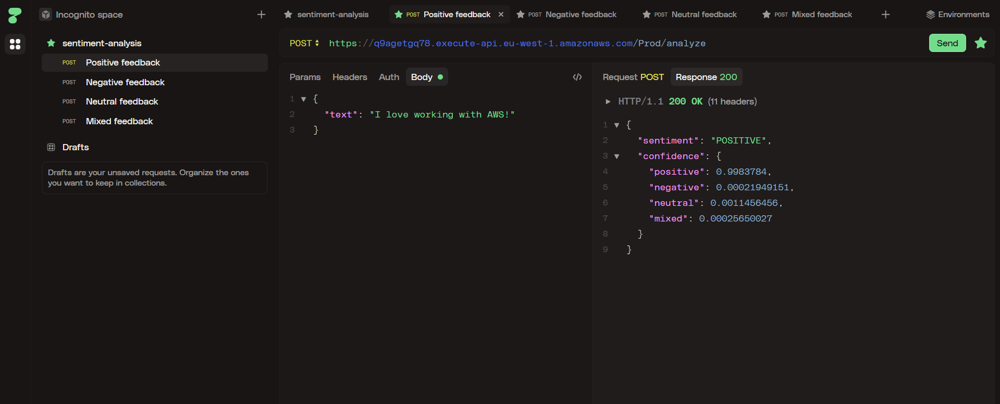
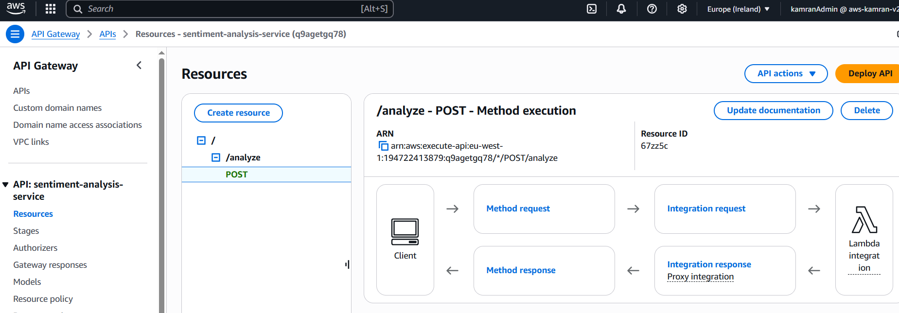
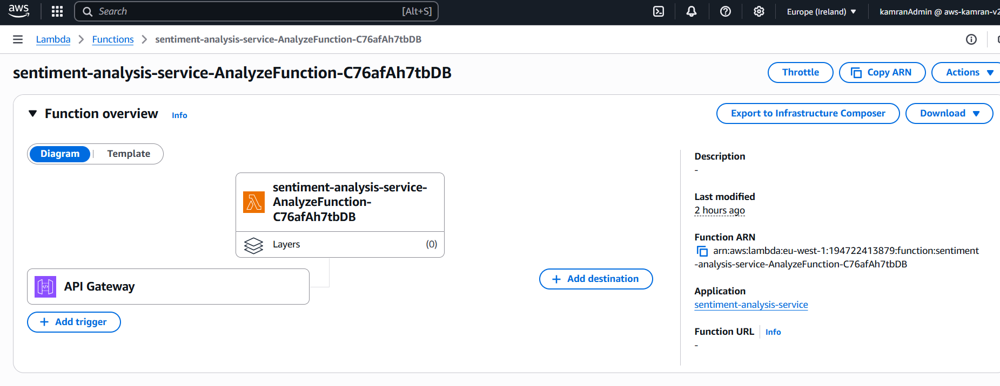

# 🧠 Sentiment Analysis Service using AWS Comprehend

[](https://www.oracle.com/java/)
[](https://aws.amazon.com/lambda/)
[](https://aws.amazon.com/api-gateway/)
[](https://aws.amazon.com/comprehend/)
[](https://aws.amazon.com/serverless/sam/)


> "In many platforms like product reviews, social media, and chat feedback, it's useful to automatically understand if a message is positive or negative.
This project provides a serverless REST API for sentiment analysis using AWS Comprehend, useful for moderation tools or feedback dashboards."

---

## 📚 Table of Contents

- [Tech Stack](#-tech-stack)
- [Overview](#-overview)
- [How It Works](#-how-it-works)
- [API Usage](#-api-usage)
- [Live Demo](#-live-demo)
- [Example Inputs](#-example-inputs)
- [Deployment Via SAM](#-deployment-via-sam)
- [Screenshots](#-screenshots)
- [Possible Improvements](#-possible-improvements)
- [Contact](#-contact)

---

## 🛠️ Tech Stack

- **Language:** Java 17
- **Build Tool:** Maven
- **Cloud Services:**
    - **AWS Lambda** – for serverless compute
    - **Amazon API Gateway** – REST API endpoints
    - **AWS Comprehend** – NLP sentiment detection
    - **AWS SAM** – infrastructure as code (IaC)

---

## 🔍 How It Works

1. You call the `/analyze` endpoint with a sentence
2. Lambda parses and sends the text to AWS Comprehend
3. Comprehend detects sentiment and confidence
4. Response is returned as JSON

---

## 📦 API Usage

### `POST /analyze`

**Request Body:**
```json
{
  "text": "I love working with AWS!"
}
```

**Response:**
```json
{
  "sentiment": "POSITIVE",
  "confidence": {
    "positive": 0.9983,
    "negative": 0.0002,
    "neutral": 0.0011,
    "mixed": 0.0002
  }
}

```

---

## 🧭 Live Demo



---

## 🧪 Example Inputs

| Sentiment | Text |
|-----------|---------------------------------------------------------------------|
| POSITIVE  | "This is the best product launch we've ever had."                   |
| NEGATIVE  | "This service is terrible. I wouldn't recommend it to anyone."      |
| NEUTRAL   | "The meeting has been rescheduled to Thursday at 10 AM."            |
| MIXED     | "I like the features, but the pricing is too high."                 |


---

## 🚀 Deployment (via SAM)

> ⚙️ **Pre-requisites**:  
> Make sure you have the **AWS CLI** and **AWS SAM CLI** installed and configured locally with appropriate credentials.

```bash
# 1. Build
sam build

# 2. Deploy
sam deploy --guided

```

---

## 🖼️ Screenshots

### 🚀 API Gateway


### ✅ Lambda - AnalyzeFunction


---


## 🧭 Possible Improvements

- 🔁 Auto-detect language before analyzing
- 📝 Implement caching for duplicate texts

---

## 📬 Contact

Built by **Kamran Zeynalov**

[](https://www.linkedin.com/in/zeynalov-kamran/)